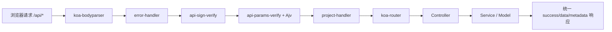
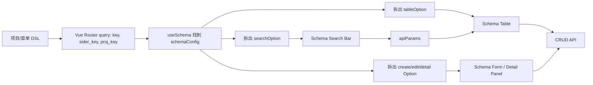

# elpis-core Git 历史还原与重新学习笔记

## 结论先行

`elpis-core` 是你在 2025-01-26 至 2025-03-16 集中开发的一套 Vue 3 + Koa2 配置化中后台内核。

它不是单纯的“动态表单组件”，而是由四部分组成：

1. Koa2 服务端内核：自动加载 config、extend、service、controller、router-schema、middleware、router。
2. BFF 通用能力：统一响应、错误捕获、日志、接口签名、Ajv 入参校验、项目上下文识别。
3. 配置化前端：用业务 Schema 描述菜单、页面类型、表格、搜索栏、表单、详情面板和操作按钮。
4. 前端工程化：Webpack 5 多入口构建、开发热更新、生产压缩与分包、Nunjucks 模板输出，最后收敛成 npm 包入口。

整个仓库共有 51 个提交：1 个初始化提交，36 个由你完成的非合并实现提交，14 个合并提交。你的提交使用了 `HUANG SHICHAO` 和 `Tpc` 三组作者信息。

需要特别注意：本地 `master` 只停在早期 Koa loader 阶段，完整成果位于 `origin/develop` 及其合并过的功能分支。为避免干扰本地工作树，本次没有切换分支，也没有改动原仓库。

## 你从头到尾具体做了什么

### 第一阶段：先搭 Koa2 内核骨架（2025-01-26 至 2025-01-30）

1. `fdc6d44`：创建空仓库，只有 README。
2. `f6abec4`：补充项目 README，明确开始建设 Eplis/Elpis。
3. `ca9f63c`：第一次搭出 Koa 内核目录，加入 `elpis-core/index.js`、环境模块和 middleware、config、controller、extend、router、router-schema、service loader，同时增加业务中间件示例和 package.json。
4. `2000eb2`：在并行分支上完成相似骨架，并重点明确 `router-schema` 的自动加载设计。
5. `b93e32a`：合并两个早期分支，将 middleware 与 router-schema 两条探索线汇总。
6. `09981c2`：补 ESLint、eslintignore 和 gitignore，开始建立工程规范。
7. `5ce1bb6`：真正完成所有 loader；增加 local、beta、prod、default 多环境配置，并让 loader 扫描目录、加载模块、挂载到 Koa app。
8. `10307cb`：增加全局 middleware 注册，让路由前可以统一执行公共中间件。
9. `3a658e9`：处理 Windows/macOS 路径分隔符和相对路径问题，并增加 `app/middleware.js` 作为全局中间件入口。
10. `d3bf612`：在 `master` 上回滚上一步路径修改。这个回滚只影响早期 `master`，后续完整开发线继续沿 feature/develop 推进。

这一阶段你的核心思路是：先约定目录，再用 loader 把文件自动注册到 `app.config`、`app.extend`、`app.service`、`app.controller`、`app.routerSchema` 和 `app.middlewares`，业务代码不需要在入口文件里逐个 `require`。

### 第二阶段：补页面渲染和 BFF 基础能力（2025-02-01 至 2025-02-14）

11. `f14fbe8`：初步接入服务端页面渲染；增加 view controller、view router、Nunjucks 模板，并支持 `/view/:page` 页面入口。
12. `947b45c`：收拢公共能力；增加 BaseController、BaseService、Project Controller/Service/Router，并加入静态资源和页面公共方法。
13. `0ac1d57`：完成第一版 elpis-core 内核应用，这是后端能力的关键提交：
    - 增加 log4js logger 扩展；
    - 增加 error-handler；
    - 增加 api-sign-verify；
    - 增加 api-params-verify；
    - 增加 project router-schema；
    - 调整 loader 和中间件装配顺序。
14. `2ac30c4`：修复 `api-params-verify` 取不到动态路由 params 的问题，尝试调整参数校验与 Router 的执行顺序。
15. `d1733ce`：将 `feature/elpis-core` 合入 `develop`，后端内核形成第一个阶段性版本。

这一阶段建立的请求思路是：请求先经过 bodyParser、错误捕获、签名校验和 Ajv 参数校验，再进入 Router、Controller、Service。

### 第三阶段：自建 Webpack 5 前端工程（2025-02-18 至 2025-02-20）

16. `634ce6a`：建立生产环境 Webpack 配置和 Vue 页面构建链路，增加 Vue Loader、Babel、CSS/Less、资源处理、HTML 模板生成及生产构建脚本。
17. `9c92046`：加入 SpeedMeasurePlugin，用来分析构建阶段耗时。
18. `5756bec`：在独立实验分支用 thread-loader 替换 HappyPack，并做线程预热。该实验分支没有成为最终 develop 的方案。
19. `74ecf4d`：完成开发环境 Webpack 配置，接入 webpack-dev-middleware、webpack-hot-middleware 和 HMR。
20. `9ac7083`：完成前端基础设施，加入统一 boot、axios/curl、Pinia store、全局样式和多页面入口。
21. `c3f1786`：把前端基础建设合入 `develop`。

最终保留的构建能力包括：多入口扫描、HtmlWebpackPlugin 输出 `.tpl`、代码分包、runtime chunk、Babel、Vue Loader、CSS 提取/压缩、Terser 并行压缩、HappyPack 多线程和开发热更新。

### 第四阶段：先设计业务 DSL，再做项目 API（2025-02-22 至 2025-02-23）

22. `39c6355`：设计第一版 Dashboard DSL。你用 JS 对象描述：
    - model 和 project；
    - 项目名称、首页和菜单；
    - group/module 菜单节点；
    - schema/custom/iframe/sider 四类模块。
23. `222cd46`：根据 DSL 改造 Project Controller、Service、Router 和 router-schema，并调整演示页面。
24. `012350e`：增加 Project Controller 测试。
25. `a311224`：开发项目列表页面、Header 容器、主题样式和项目入口。
26. `0ffdc40`、`1c12ccf`：将 DSL 和项目列表开发线分别合入 develop/GitHub 开发线。

这一步很关键：你没有直接写死 Dashboard，而是先定义“项目和页面应该怎么被描述”，再让 API 和页面消费这份描述。

### 第五阶段：把 DSL 变成可导航的 Dashboard（2025-02-25 至 2025-02-27）

27. `bd63c6a`：完善 Dashboard 所需 API 和测试；增加项目列表、模型列表、项目详情接口，补统一 success/fail 响应和异常测试。
28. `b63bb42`：引入 Vue Router，开发 Dashboard 和 Header View；根据菜单的 `moduleType` 跳转到 schema、custom、iframe 或 sider 页面。
29. `f296f81`：完成 Sider View 和递归子菜单，让头部菜单下面还能继续挂侧边栏业务模块。
30. `08502ff`：完成 Iframe View，根据菜单配置动态加载外部或内部页面。
31. 多个 Merge Request 将 Dashboard、Sider 和 Iframe 功能合回 develop。

到这里，DSL 已经能控制菜单结构和页面容器，但 Schema 页面里的表格、搜索和表单还没有完成。

### 第六阶段：完成 Schema View 和动态表格（2025-02-27 至 2025-03-02）

32. `4037421`：完成 Schema View 第一版；新增 `useSchema` hook，从当前路由和菜单 store 中找到 schemaConfig，并拆出 Table/Search 所需配置。
33. `f4bbbdb`：完成 Schema Table：
    - 遍历 `schema.properties` 动态生成 Element Plus 列；
    - 支持列显示、宽度和 Element Plus 原生列属性透传；
    - 支持分页、加载状态、列表请求和简单数据格式化；
    - 根据配置生成行操作按钮。
34. `e2d6d87`：完成 Table Panel，并接通业务 CRUD API；增加 project-handler，为 `/api/proj/*` 请求注入项目上下文；前端路由切换为 History 模式；加入删除按钮参数映射和刷新列表逻辑。

此时已经形成“Schema 描述列和按钮，Table 负责渲染，Panel 负责业务操作”的分层。

### 第七阶段：完成动态搜索栏（2025-03-04）

35. `1e65dcd`：完成 Schema Search Bar 和 Search Panel：
    - 支持 input、select、dynamicSelect、dateRange 四种搜索控件；
    - 用 `search-item-config.js` 做组件类型映射；
    - 子控件统一暴露 `getValue` 和 `reset`；
    - 搜索值写入 `apiParams`，触发表格重新请求；
    - dynamicSelect 可通过 API 异步加载枚举项。

这部分实现了真实存在的一条联动：搜索栏状态变化 -> API 参数变化 -> Table 重新拉取数据。它不是通用的“字段依赖联动引擎”。

### 第八阶段：完成动态表单和完整 CRUD（2025-03-12）

36. `ea9356c`：一次性补齐 Schema Form、Create Form、Edit Form 和 Detail Panel，是前端功能量最大的提交，共新增/修改 23 个文件，增加约 1386 行：
    - Schema Form 根据字段 `comType` 动态选择控件；
    - 实现 input、inputNumber、select、dateRange 四种表单控件；
    - 控件统一暴露 `validate` 和 `getValue`；
    - input/inputNumber/select 使用 Ajv 做字段级校验；
    - 支持 required、type、minLength、maxLength、pattern、minimum、maximum、enum 等规则；
    - Create Form 负责 POST 新增；
    - Edit Form 先 GET 回填，再 PUT 保存；
    - Detail Panel 按主键 GET 并展示详情；
    - Table 的按钮通过 `eventKey + eventOption` 打开对应动态组件；
    - 后端补齐 GET/POST/PUT/DELETE 的业务路由、Schema 和示例 Controller。

到这个提交，配置驱动的“搜索 + 表格 + 新增 + 编辑 + 详情 + 删除”闭环才真正完成。

### 第九阶段：从业务项目抽成可复用内核（2025-03-13 至 2025-03-16）

37. `cb2406f`：重构所有 loader，使其同时扫描 elpis-core 自带目录和使用方的 `app/*` 业务目录；加入 `baseDir/businessDir`，为 npm 包复用做准备。
38. `60ccf80`：从包入口暴露 `serverStart`、`frontendBuild`、BaseController 和 BaseService；Webpack 也开始同时读取内核页面和业务页面。
39. `d808c68`、`69d741d`：支持业务自定义 SSR/模板页面和业务多入口，删除内核中的项目列表业务页，继续降低核心包与示例业务的耦合。
40. `8cc094a`：增加业务扩展点：
    - Dashboard 自定义路由；
    - Schema View 自定义业务组件；
    - Schema Form 自定义控件；
    - Schema Search Bar 自定义控件。
    同时删除 JD/PDD/淘宝等演示模型数据。
41. `b4ddd4d`：完成 npm 包收口：
    - 包名改为 `@tpccool/elpis`；
    - 版本设为 `1.0.0`；
    - README 补充使用和扩展说明；
    - 删除 business controller/router/router-schema 和 DSL 文档等示例业务代码；
    - 只保留内核和扩展机制。
42. `850c3c` 至 `48f7b3d`：依次将 Schema View、Schema Table、Schema Form、SDK/npm 分支合入 `develop`，形成最终完整历史。

## 后端请求链路



服务启动时的顺序是：config -> extend -> service -> controller -> router-schema -> middleware -> 全局 middleware -> router。

各 loader 会扫描约定目录，将模块挂到 Koa app：

- `app.config`
- `app.logger` 等扩展
- `app.service.*`
- `app.controller.*`
- `app.routerSchema[path][method]`
- `app.middlewares.*`

Ajv 参数校验的实际实现是：按 `ctx.path + HTTP method` 找到接口 Schema，然后按 body、params、headers、query 顺序校验。校验失败统一返回业务码 `442`。

## 前端 Schema 渲染链路



这套 Schema 不是严格的标准 JSON Schema，而是“以 JSON Schema 字段约束为基础，再扩展 UI 配置”的业务协议：

- 标准约束：type、required、minLength、maxLength、pattern、minimum、maximum 等。
- UI 扩展：label、tableOption、searchOption、createFormOption、editFormOption、detailPanelOption。
- 页面扩展：tableConfig、componentConfig、eventKey、eventOption。
- 模块扩展：schema、custom、iframe、sider。

## 简历内容与 Git 证据核验

| 简历表述 | Git 是否支持 | 更准确的说法 |
| --- | --- | --- |
| 设计 JSON Schema 数据驱动协议 | 支持 | 设计了基于 JSON Schema 约束并扩展 UI Option 的业务 Schema 协议 |
| 动态生成 Form/Table/Search | 支持 | 三类组件和完整 CRUD 链路都有源码及提交记录 |
| 支持 20+ 字段类型 | 不支持 | 实际有 4 类表单控件、4 类搜索控件，共 5 种不同控件类型；架构支持继续注册扩展 |
| 支持自定义插件扩展 | 基本支持 | 最终版本可通过业务配置文件扩展 Dashboard 路由、Schema View 组件、Form/Search 控件 |
| 字段联动逻辑 | 证据不足 | 有搜索栏到表格的数据联动，没有通用字段依赖图、effect 或条件联动引擎 |
| Koa2 BFF 层 | 支持 | 有自动 loader、中间件、Router/Controller/Service 分层、统一响应和接口校验 |
| 错误捕获、日志跟踪、权限校验 | 部分支持 | 有统一错误捕获、log4js 日志和接口签名校验；没有用户身份、角色或 RBAC 权限实现，也没有 traceId 链路追踪 |
| Ajv 支持多个字段错误并精准标红 | 当前实现不支持 | 前端是逐字段校验并标红；后端默认只返回第一个失败项的文本，没有结构化返回全部错误 |
| 优化 Webpack 5 构建流程 | 支持“做过优化” | 有多入口、分包、HMR、CSS 提取/压缩、Terser 并行和多线程实验，但 Git 中没有构建耗时对比数据 |
| 需求从 1 天缩短到 2 小时、重复代码减少 80% | Git 无法证明 | 需要你准备真实业务统计口径，否则建议删除或改成非量化描述 |
| 完成 npm 包发布 | 部分支持 | Git 能证明包名、1.0.0 版本和公共 API 收口；没有 tag，本次也未核验 npm registry 上是否真实可下载 |

另外，Git 可证明的集中开发日期是 2025-01-26 至 2025-03-16；简历项目日期写的是 2024.07 至 2025.04。若 2024 年已有公司内部原型，需要用公司项目事实补充；仅凭这个仓库无法证明 2024.07 就开始开发。

## 面试时最稳的项目介绍

“这个项目是我基于 Vue3、Element Plus、Koa2 和 Webpack5 做的一套配置化中后台内核。最初我先在 Koa2 里实现 config、service、controller、router、middleware 和 router-schema 的自动加载，再加入统一错误处理、日志、接口签名和 Ajv 参数校验。前端先设计项目与菜单 DSL，然后逐步实现 Dashboard、动态表格、搜索栏和表单。业务只需要在一份 Schema 里描述字段类型、显示位置、组件类型和按钮行为，系统就能生成搜索、列表、新增、编辑、详情和删除页面。最后我把内核目录和业务目录拆开，暴露服务启动、前端构建及组件扩展入口，并收敛成 `@tpccool/elpis` 1.0.0 包结构。”

不要在这个项目上主动声称以下内容：20+ 控件、完整低代码平台、RBAC 权限、通用字段联动引擎、结构化返回全部 Ajv 错误、已经量化验证 80% 效率提升。

## 建议重新学习顺序

1. 先看提交拓扑，理解为什么 `master` 很旧、`origin/develop` 才完整。
2. 学启动入口和七类 loader，自己画出 `app` 上挂载了哪些对象。
3. 学全局中间件顺序，手工走一遍成功请求、签名失败、参数失败和 Controller 抛错。
4. 学 project/model DSL，理解 menuType 与 moduleType 的组合关系。
5. 学 Dashboard 路由和 Header/Sider/Iframe/Schema 四种页面容器。
6. 学 `useSchema` 如何把一份总 Schema 拆成 Table、Search、Form DTO。
7. 学 Schema Table 的数据请求、分页、操作事件和删除参数映射。
8. 学 Schema Search Bar 的控件注册、取值、重置以及如何驱动 Table 刷新。
9. 学 Schema Form 的控件注册、Ajv 字段校验、取值、新增、编辑和详情。
10. 最后学 Webpack 的多入口扫描、模板输出、HMR、生产优化和业务扩展 alias。
11. 回看最后四个抽包提交，理解“能跑的业务 Demo”如何被拆成“可供业务接入的内核包”。

## 在 macOS 启动完整示例

最终 `origin/develop` 已经删除了演示业务，只保留 npm 内核。要运行项目列表、JD 商品管理、动态搜索/表格/表单这一整套示例，应当使用功能闭环快照 `ea9356c`，并通过独立 worktree 避免切换当前分支：

```bash
cd /Users/tpc/code/tpc_code/elpis-core
git worktree add ../elpis-core-demo ea9356c
cd ../elpis-core-demo
npm install
```

打开第一个终端，启动 Webpack 开发服务器（静态资源和 HMR 使用 9002 端口）：

```bash
cd /Users/tpc/code/tpc_code/elpis-core-demo
NODE_ENV=local node --max_old_space_size=4096 app/webpack/dev.js
```

看到 `webpack compiled successfully` 后，打开第二个终端，启动 Koa 服务（8080 端口）：

```bash
cd /Users/tpc/code/tpc_code/elpis-core-demo
NODE_ENV=local node index.js
```

浏览器访问：

```text
http://127.0.0.1:8080/view/project-list
```

点击 JD 后会进入：

```text
http://127.0.0.1:8080/view/dashboard/schema?proj_key=jd&key=product
```

这里可以查看 Schema 生成的搜索栏、商品表格、新增表单、编辑表单和详情面板。示例 Controller 返回的是内存中的模拟数据，新增、编辑和删除接口会返回成功信息，但不会持久化到数据库。

原 `package.json` 的 `npm run dev` 使用了 Windows 的 `set NODE_ENV=...` 写法；在 macOS 上直接使用上述 `NODE_ENV=local node ...` 命令更准确。

## 复习 Git 历史时常用命令

```bash
cd /Users/tpc/code/tpc_code/elpis-core

# 查看完整分支拓扑
git log --all --graph --decorate --oneline --date-order

# 按时间查看所有实现提交和文件变化
git log --all --reverse --no-merges --date=short \
  --format='===== %h %ad %s =====' --name-status

# 不切换分支，直接看最终 develop 中某个文件
git show origin/develop:elpis-core/index.js

# 查看抽包前仍保留完整业务 Demo 的版本
git ls-tree -r --name-only ea9356c
git show ea9356c:model/buiness/model.js

# 查看某一步具体修改
git show ea9356c
git show b4ddd4d
```

重新学习时，`ea9356c` 是最重要的业务闭环快照，`origin/develop` 是最终内核快照，`b4ddd4d` 是理解抽包过程最重要的提交。
